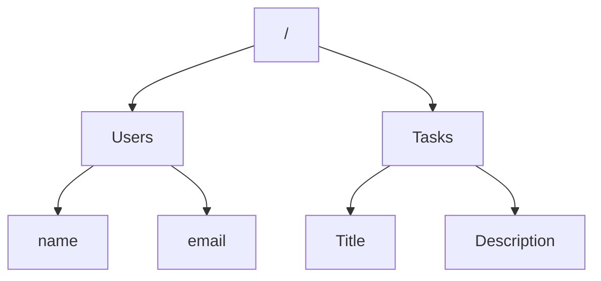
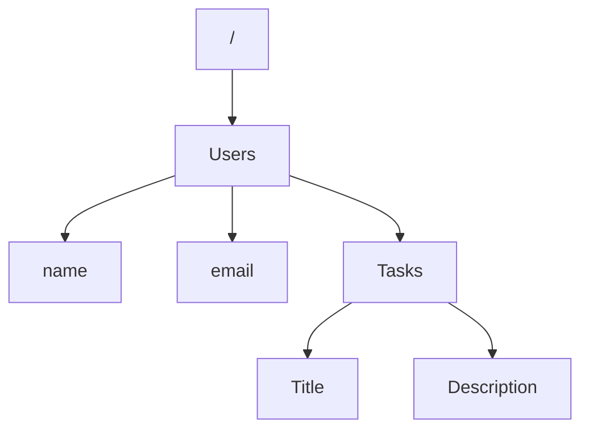

# The TodoList

> [Extensión de Markdown](https://marketplace.visualstudio.com/items?itemName=shd101wyy.markdown-preview-enhanced)

<!-- @import "[TOC]" {cmd="toc" depthFrom=1 depthTo=6 orderedList=false} -->

<!-- code_chunk_output -->

- [The TodoList](#the-todolist)
  - [Briefing](#briefing)
  - [1, 2, GIT](#1-2-git)
  - [Diseñando una base de datos](#diseñando-una-base-de-datos)
  - [Diseñando una API](#diseñando-una-api)
    - [Métodos](#métodos)
      - [Ejemplos](#ejemplos)
        - [Crear un usuario](#crear-un-usuario)
        - [Editar un usuario](#editar-un-usuario)
        - [Iniciar sesión](#iniciar-sesión)
    - [Parámetros](#parámetros)
    - [Códigos de Respuesta](#códigos-de-respuesta)
  - [Diseñar el frontend](#diseñar-el-frontend)
  - [Conclusión](#conclusión)
    - [Equipos](#equipos)

<!-- /code_chunk_output -->

Aquí te presento el primer proyecto Full Stack, el cual incluye Front, Back y Bases de Datos.

A la hora de desarrollar una aplicación es muy importante diseñar desde la capa más abstracta, por ello es esencial empezar desde el modelo (`base de datos`), pasando al controlador (`API`) y terminando con la vista (`front`).

```sequence
Title: Diagrama MVC
participant Vista as V
participant Controlador as C
participant Modelo as M

Note over M: El modelo,\nsolo es accesible\npara el controlador

V-->C: Pide datos\nen base a\nunos criterios

Note over V, C: La conexión sigue abierta\nhasta que se efectue\nuna respuesta

Note over C: Verifica que\nla petición\nsea correcta

C->M: Pide datos que\ncumplan los criterios

M->C: devuelve los datos

Note over C: Procesa los datos\ny les da un formato

C-->V: Responde a la petición\ncon los datos solicitados

Note over V: Pintar los\ndatos al\nusuario 
```

> :bulb: Este proyecto tendrá diferentes iteraciones que se irán liberando a medida que avances en los requisitos.

## Briefing

En esta primera etapa debes comenzar con una `lista de tareas` básica:

El usuario deberá poder ingresar un `nombre de tarea` y una `descripción`, una vez enviada, esta deberá ser `accesible por cualquier visitante` de nuestra app.

En caso de desearlo, el usuario deberá poder ingresar una `fecha límite` (para la realización de la tarea), así como una `prioridad` (recomendable entre 1 y 4).

Una vez introducida una nueva `tarea`, para `completarla`, bastará con `hacer click` sobre la tarea creada. Si por el lado contrario se desea `eliminarla`, el usuario debe poder hacer click sobre el `icono de una x o de una papelera`.

En la visualización, deben aparecer las `tareas completadas` con un `estilo diferente` a las incompletas, además, en lugar de mostrarse la fecha límite, se debe `mostrar la fecha de completado`.

Una tarea puede completarse y una tarea completada puede volver a no completada.

## 1, 2, GIT

Lo primero y más importante de todo es iniciar un repositorio de git, ya que si perdemos parte de nuestro progreso podremos recuperarlo, o simplemente juntar el trabajo del grupo.

Cuando creamos un repo en GitHub podemos añadir colaboradores en `settings > manage acess`.

Existen varias formas de trabajar con git, para este proyecto ninguna de ellas es obligatoria, pero si aconsejables, puesto que te permitirá trabajar de una forma más sencilla con tus compañeros.

> :bulb: Personalmente os recomiendo trabajar con ramas

[Cómo Trabajar con ramas de git](https://desarrolloweb.com/articulos/trabajar-ramas-git.html)
[Aprende a trabajar con ramas](https://learngitbranching.js.org/?locale=es_es)
[Diccionario de git](https://gitexplorer.com/)

> :bulb: También existe una metodología llamada **[gitflow](https://www.atlassian.com/es/git/tutorials/comparing-workflows/gitflow-workflow)** que permite desarrollar de forma más eficiente.

@import "https://media.giphy.com/media/cFkiFMDg3iFoI/giphy.gif"
Nunca temas a git, **es capaz de oler el miedo.**

> :bulb: Cada vez que algo funcione **haz un commit** y te ahorrarás unos buenos sustos

## Diseñando una base de datos

A la hora de ponerse a diseñar la base de datos debes conocer cuales son los datos que necesitas, por lo que `analiza el briefing` y deduce con tu equipo que datos debes almacenar (puede suceder que estos requisitos cambien más adelante).

Una vez sabes que datos necesitas, plantea la `estructura` de la base de datos, cuanto más `sencilla y estructurada` sea, más fácil será de usar. Para ello, agrupa los contenidos en bloques temáticos (tareas, usuarios, grupos...)

[Guía de Firebase para estructurar los datos](https://firebase.google.com/docs/database/admin/structure-data)

Ejemplo:



Ejemplo 2:



## Diseñando una API

A la hora de diseñar una API es muy importante tener en mente la experiencia del desarrollador, cuanto más fácil y sencilla sea de usar, mucho mejor.

Para diseñar una buena API es muy importante tener siempre en mente los diferentes [métodos HTTP](https://developer.mozilla.org/es/docs/Web/HTTP/Methods):

> :bulb: Cada endpoint debe hacer tan solo una cosa

### Métodos

- **GET**: Obtener datos
- **POST**: Crear una entrada nueva en Base de Datos
- **PUT**: Actualizar toda la información
- **PATCH**: Actualizar solo algunos campos
- **DELETE**: Eliminar una entra en la Base de Datos

> :bulb: Siempre trata de ser explícito al nombrar los diferentes endpoints, pero nunca redundante.

#### Ejemplos

##### Crear un usuario

**NO**
  `POST` "/createUser"
**SI**
  `POST` "/user"

Esto es debido a que el método `POST` ya explica que se crea un usuario

##### Editar un usuario

**NO**
  `POST` "/editUser"
**SI**
  `PATCH/PUT` "/user"

Si queremos actualizar debemos usar `PATCH` o `PUT`, luego hemos de usar estos métodos, los cuales, además, nos ahorran especificar que ese endpoint edita.

##### Iniciar sesión

**NO**
  `GET` "/login"
**SI**
  `POST` "/login"

A la hora de mandar datos sensibles, si que es muy importante no mandarlos por `GET`, puesto que al ir los datos en URL, quedarían expuestos a la red.

### Parámetros

Siempre ten en cuenta qué información necesitas para operar en cada endpoint, para ello, te pueden proveer de diferentes parámetros en la petición.

> :bulb: Un endpoint solo debe aceptar los parámetros especificados, en caso de tener otros, la petición debe responder un error o bien ignorar dicho parámetro

- **Query Params**: En caso de necesitar pasar los parámetros por URL, su uso queda limitado a aquellos parámetros que sean `opcionales` o que no tenga sentido escribirlos siempre en un orden establecido.
- **Rest Params**: En caso de necesitar pasar los parámetros por URL, si son obligatorios y han de ir en el mismo orden.
- **Body Params**: Cuando se trata de información comprometida o grandes cantidades de datos (Nunca cuando el método es `GET`).

### Códigos de Respuesta

Cuando enviamos una respuesta con express podemos enviar un código de respuesta asociado para poder manejar los diferentes errores en front, por ello es muy importante que trates de establecerlos siempre.

[Cómo establecer un código de estado en express.js](https://www.geeksforgeeks.org/express-js-res-status-function/)
[Códigos de estado](https://developer.mozilla.org/es/docs/Web/HTTP/Status)

> :bulb: Es muy importante responder con el código apropiado para tener un buen diseño de una API.

## Diseñar el frontend

Una vez está terminada toda la parte de Backend, es el momento ideal para comenzar con el frontend, ya todo funciona y tan solo necesitamos conectar las acciones del usuario con nuestro controlador (API).

Recomiendo empezar siempre por el diseño de la aplicación, después pasar al peticionamiento de datos y por último la maquetación.

Si queremos ahorrarnos problemas, al menos por ahora, back sería quien tiene que [servir los archivos estáticos](https://expressjs.com/en/starter/static-files.html).

Finalmente, lo bien que funcione nuestra app dependerá de esta capa, no solo de lo rápido que funcione, si no de lo fácil, intuitiva y usable que sea,  sin olvidarnos nunca del factor bonito, para ello grandes empresas como [twitter](https://about.twitter.com/) han diseñado componentes para facilitar la vida de los desarrolladores, por lo que recomiendo altamente el uso de herramientas como [bootstrap](https://getbootstrap.com/docs/5.0/getting-started/introduction/) o similares.

[Las 24 alternativas a Bootstrap](https://ciberninjas.com/bootstrap-alternativas/#2-materialize-css)

## Conclusión

Organiza bien todos los pasos que quieres implementar así como las características, lo cual llevará a tener bien cubiertas las necesidades y podrás trabajar de la forma más eficiente.

Siempre ten en mente la usabilidad de tu aplicación, no solo a nivel usuario final si no también a nivel desarrollo, comenta tu código y explica tus decisiones en él.

### Equipos

- Equipo 1
  - Pablo
  - Miguel
  - Manuel
- Equipo 2
  - Ciscu
  - Luz
  - Matías
